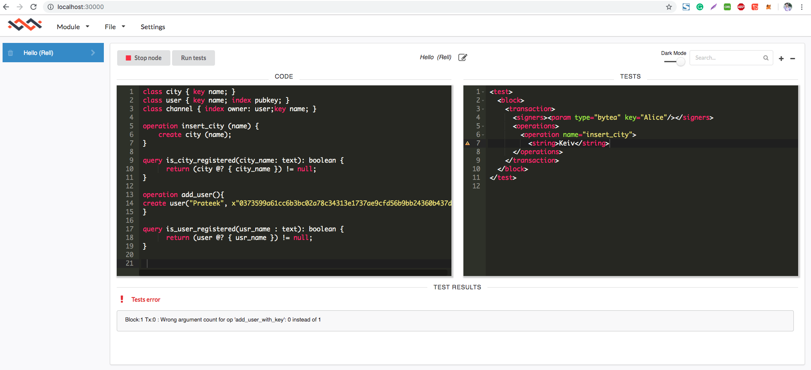

<h3> RELL IS OPEN SOURCE BLOCKCHAIN </h3>
<h4>https://chromapolis.com/</h4>

Open cmd and Type 
>docker-composer up

Open browser and type localhost:30000 
>Create new module  
>Start the test cases  

Open Another cmd and Type
>node index.js   
>node add_users.js  
>open output to see output images

